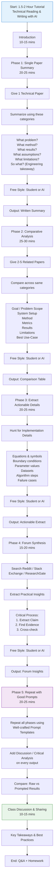

```mermaid

graph TD
    A[Start: 1.5-2 Hour Tutorial<br>Technical Reading & Writing with AI] --> B[Introduction<br>10-15 mins]

    B --> C1[Phase 1: Single Paper Summary<br>20-25 mins]
    C1 --> C2[Give 1 Technical Paper]
    C2 --> C3[Summarize using these categories]
    C3 --> C4["What problem?<br>What method?<br>What results?<br>What assumptions?<br>What limitations?<br>So what? (Engineering takeaway)"]
    C4 --> C5[Free Style: Student or AI]
    C5 --> C6[Output: Written Summary]

    C6 --> D1[Phase 2: Comparative Analysis<br>25-30 mins]
    D1 --> D2[Give 2-5 Related Papers]
    D2 --> D3[Compare across same categories]
    D3 --> D4["Goal / Problem Scope<br>System Setup<br>Method<br>Metrics<br>Results<br>Limitations<br>Best Use-Case"]
    D4 --> D5[Free Style: Student or AI]
    D5 --> D6[Output: Comparison Table]

    D6 --> E1[Phase 3: Extract Actionable Details<br>20-25 mins]
    E1 --> E2[Hunt for Implementation Details]
    E2 --> E3["Equations & symbols<br>Boundary conditions<br>Parameter values<br>Datasets<br>Algorithm steps<br>Failure cases"]
    E3 --> E4[Free Style: Student or AI]
    E4 --> E5[Output: Actionable Extract]

    E5 --> F1[Phase 4: Forum Synthesis<br>15-20 mins]
    F1 --> F2[Search Reddit / Stack Exchange / ResearchGate]
    F2 --> F3[Extract Practical Insights]
    F3 --> F4["Critical Process:<br>1. Extract Claim<br>2. Find Evidence<br>3. Cross-check"]
    F4 --> F5[Free Style: Student or AI]
    F5 --> F6[Output: Forum Insights]

    F6 --> G[Phase 5: Repeat with Good Prompts<br>20-25 mins]
    G --> H[Repeat all phases using<br>Well-crafted Prompt Templates]
    H --> I[Add Discussion / Critical Analysis<br>on every output]
    I --> J[Compare: Raw vs Prompted Results]

    J --> K[Class Discussion & Sharing<br>10-15 mins]
    K --> L[Key Takeaways & Best Practices]
    L --> M[End: Q&A + Homework]

    style A fill:#e3f2fd, stroke:#1976d2
    style G fill:#f3e5f5, stroke:#7b1fa2
    style K fill:#e8f5e9, stroke:#388e3c
```

