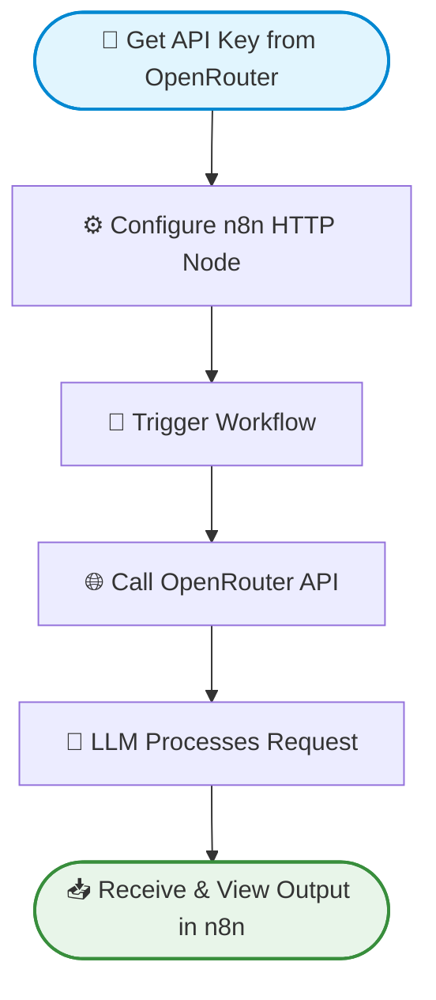
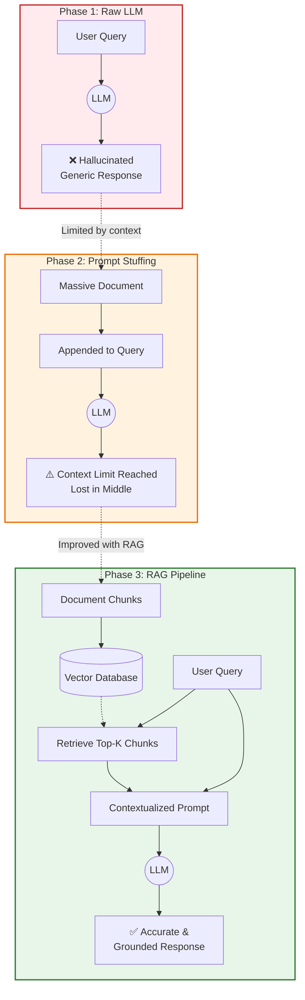
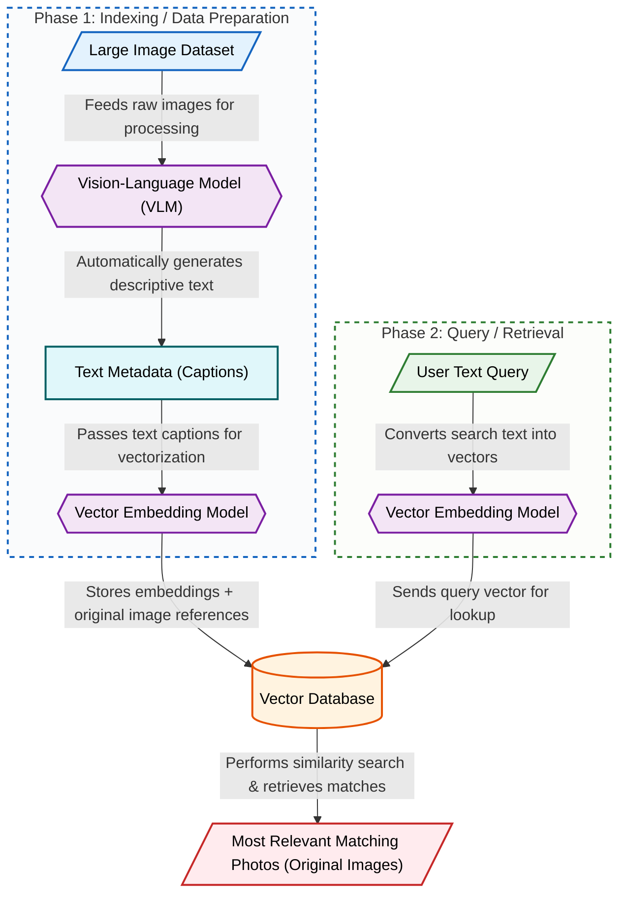

# AILT9018 Artificial Intelligence Literacy II – AI for Engineers
## Module: Fundamentals in NLP, LLM and RAG

### 1. Module Overview
This three-class module is designed to take engineering students on a progressive, hands-on learning journey from basic AI interactions to building advanced multimodal systems. Starting with a gentle, no-code introduction to LLM APIs, students quickly transition into intermediate Python programming to solve real-world AI hallucination problems using Retrieval-Augmented Generation (RAG). The module culminates in an advanced exploration of Vision-Language Models (VLMs) and joint vector spaces, empowering students to build sophisticated, multimodal retrieval pipelines. By the end of this series, students will have transformed from passive AI consumers into capable AI system architects.

---

### 2. Class 1: Introduction to LLM APIs and No-Code Automation
**Level:** Beginner

**Learning Objectives:**
* Understand the basic concept of Application Programming Interfaces (APIs) without complex jargon.
* Successfully navigate the OpenRouter platform to generate and manage API keys.
* Build and execute a functional AI workflow using a zero-code automation tool (n8n).

**Key Topics:**
* **APIs Demystified:** What they are, how they act as bridges between software, and why engineers use them.
* **The OpenRouter Ecosystem:** Accessing a variety of industry-leading LLMs through a single standardized endpoint.
* **Introduction to n8n:** Understanding node-based visual programming and workflow automation.

**Hands-on Activities & Demo:**
* **Live Setup:** Instructor-led walk-through of creating an OpenRouter account and securing an API key.
* **Interactive Demo:** Students will build their first n8n workflow, configuring an HTTP Request node to send a prompt to an LLM and parse the JSON response.

**How This Class Helps Students:**
This introductory class removes the intimidation factor of working with code by using a visual interface, giving students an immediate "quick win." It establishes a foundational understanding of how software communicates with AI brains, which is essential before writing custom scripts.

---

### 3. Class 2: Building Your Own RAG Chatbot
**Level:** Intermediate

**Learning Objectives:**
* Identify the limitations of raw LLMs, specifically hallucination and lack of domain-specific knowledge.
* Evaluate the pros and cons of "prompt stuffing" versus retrieval-based approaches.
* Implement a foundational Python-based RAG pipeline using vector embeddings.

**Key Topics:**
* **The Context Problem:** Why LLMs fail with private data and the limitations of context windows.
* **RAG Principles:** The architecture of Retrieval-Augmented Generation (Chunking, Embedding, Searching, Generating).
* **Embeddings 101:** Converting text into mathematical vectors for similarity search.

**Hands-on Activities & Demo:**
* **Progressive Python Experiments:** Students will run code that demonstrates three distinct approaches:
    1.  *Raw LLM:* Asking a niche question and observing a hallucinated answer.
    2.  *Prompt Stuffing:* Injecting a massive document into the prompt and observing latency/token limits.
    3.  *Full RAG Pipeline:* Using a localized vector search to extract only relevant chunks to feed the LLM.

**How This Class Helps Students:**
By experiencing the failures of raw LLMs and prompt stuffing firsthand, students deeply understand *why* RAG is the industry standard for enterprise AI. The step-by-step Python demo provides them with a tangible, reusable codebase they can apply to their own engineering projects.

---

### 4. Class 3: Vision-Language Models (VLMs) and Multimodal Retrieval
**Level:** Advanced

**Learning Objectives:**
* Understand the underlying mechanics of Vision-Language Models (VLMs).
* Explain how CLIP (Contrastive Language-Image Pretraining) maps text and images into a shared vector space.
* Design and execute a multimodal retrieval system using a Vector Database and cosine similarity.

**Key Topics:**
* **Beyond Text:** The rise of VLMs and their applications in engineering (e.g., visual inspection, robotics).
* **Joint Vector Spaces:** How CLIP translates pixels and words into the same mathematical language.
* **Cosine Similarity:** The mathematical core of determining how "close" an image is to a text description.

**Hands-on Activities & Demo:**
* **Automated Labeling Pipeline:** Using an LLM to automatically generate metadata/captions for a dataset of photos.
* **Vector Search Demo:** Storing image metadata in a Vector Database, calculating embeddings, and retrieving the exact correct photo simply by typing a descriptive text query.

**How This Class Helps Students:**
This advanced session pushes students to the cutting edge of current AI technology, demonstrating that AI is not limited to text chatbots. Understanding multimodal embeddings equips engineering students to build smart systems capable of processing and retrieving complex, real-world visual data.

---

### 5. Overall Student Benefits
This three-part module strategically builds engineering students' confidence, practical skills, and deep conceptual understanding of modern AI architectures. By beginning with accessible, no-code integrations, students avoid initial syntax friction and focus purely on system logic. As they progress into intermediate and advanced Python applications, they acquire highly sought-after industry skills—specifically building RAG pipelines and handling multimodal vector databases. Ultimately, this course bridges the gap between theoretical AI concepts and practical software engineering, empowering students to design custom, data-grounded AI tools for their future careers.